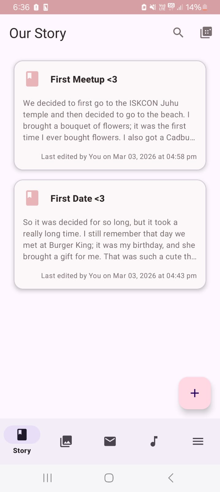
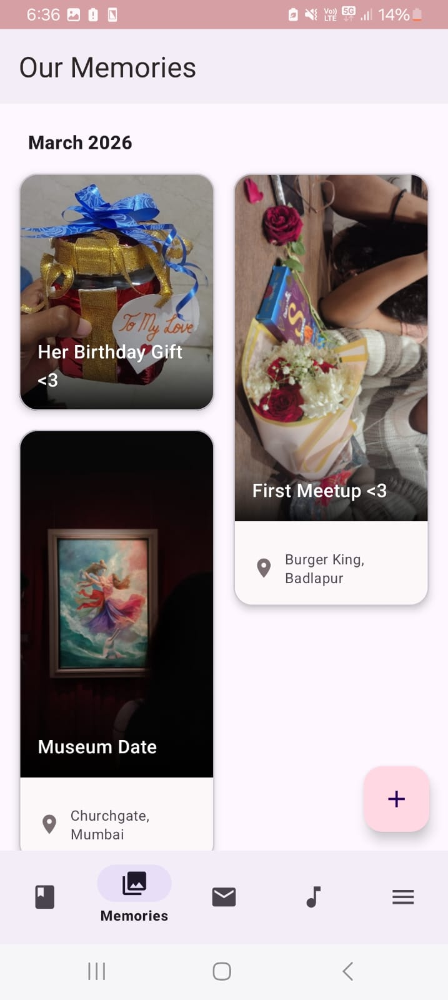
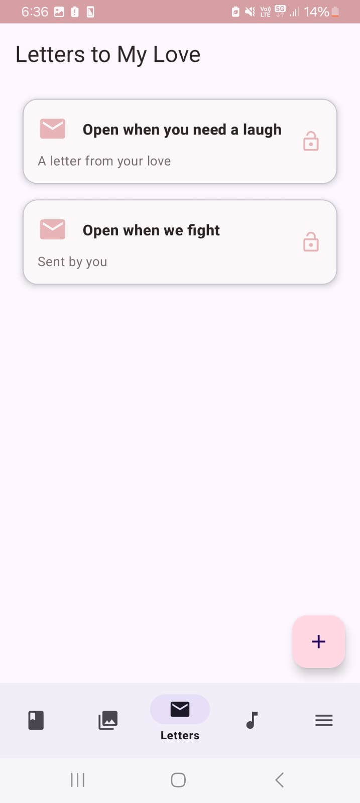
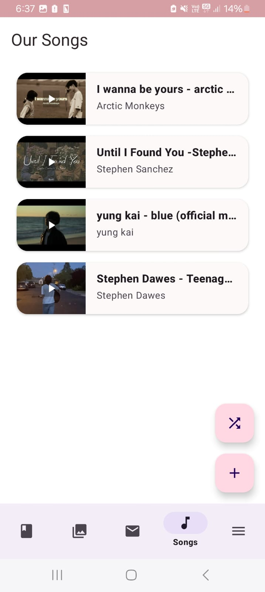
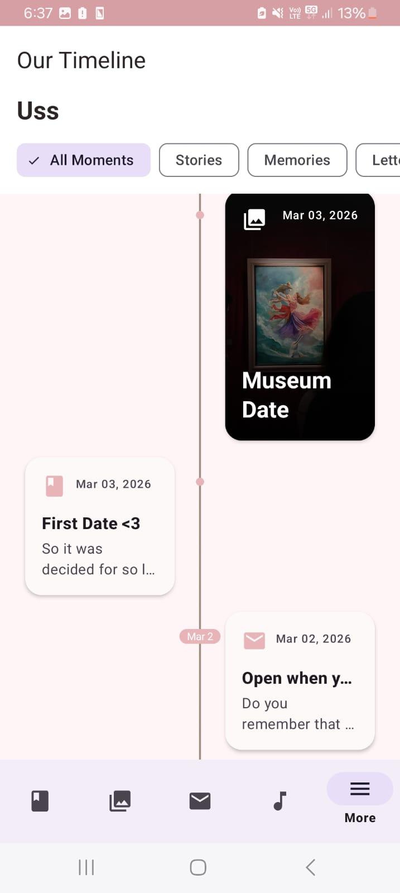
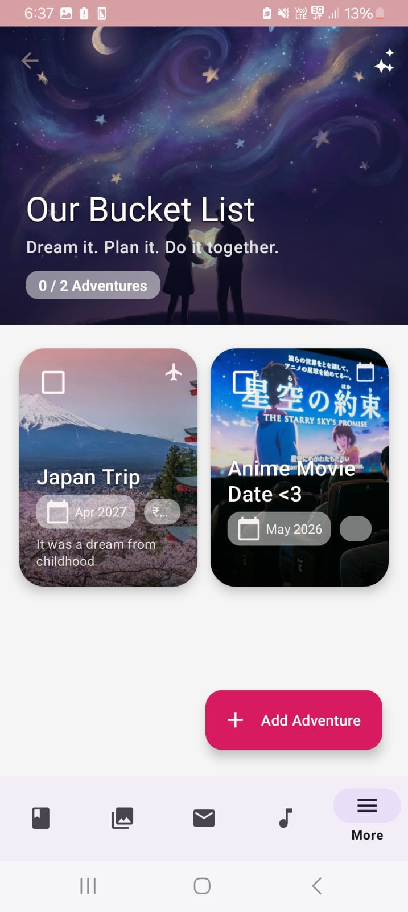
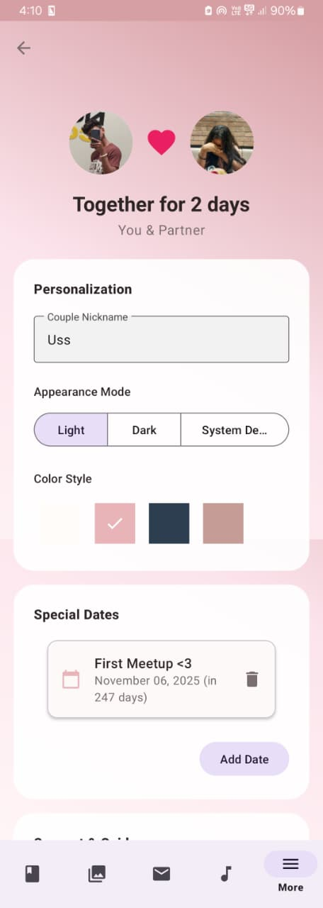
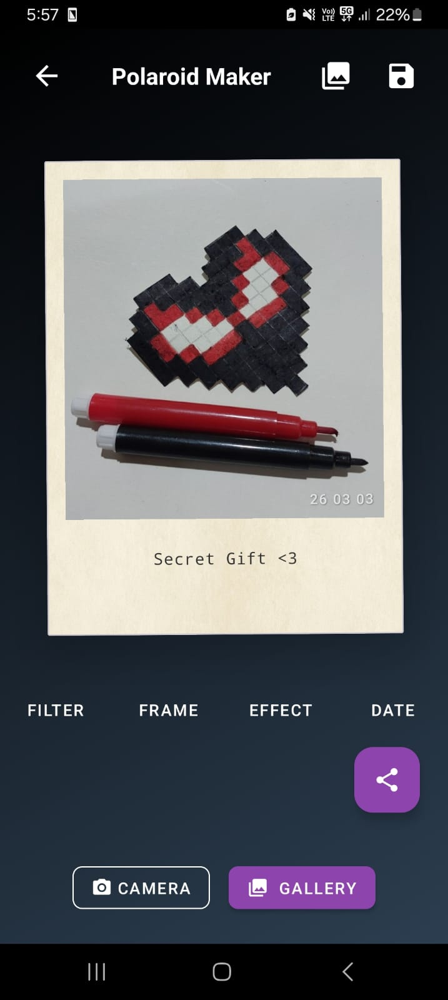
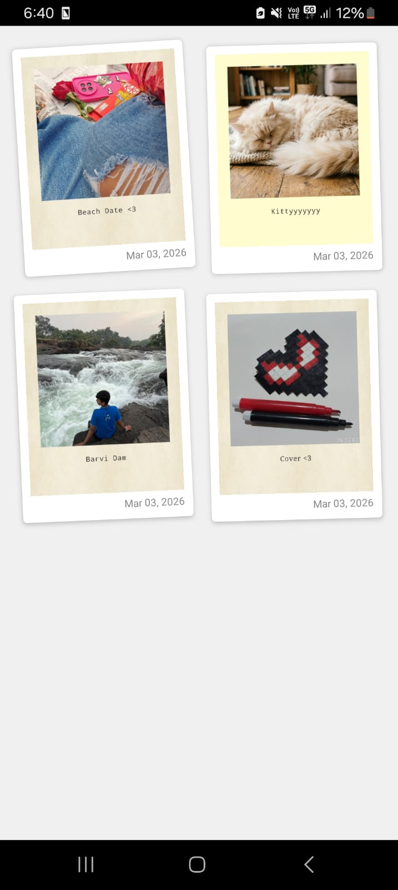

<div align="center">
  
  <h1>ForeverUs 💖</h1>
  <p><em>A digital scrapbook and private sanctuary for couples to capture, organize, and cherish their shared memories.</em></p>

  <!-- Badges -->
  
  
  
</div>

<br />

## ✨ Comprehensive Features

📸 **Memories Timeline** - Create an interactive, scrollable timeline of your relationship. Upload photos, videos, and audio clips directly via **Cloudinary**.  
📅 **"On This Day"** - Automatically bubble up memories that happened on the exact same date in previous years.  
💌 **Smart Letters** - Compose, lock, and share private letters with your partner. Experience beautiful **falling petals animations** when unlocking and reading them.  
🎵 **Dedicated Songs List** - Curate a shared playlist of meaningful songs powered by the **YouTube API**.  
🗺️ **Adventure Board & Bucket List** - Plan future trips and track your shared relationship goals.  
🤖 **Story Editor & PDF Export** - Create rich, visual stories of your experiences with AI-assisted text generation via **Google Gemini AI**. Export these stories into a beautiful PDF format to keep forever.  
🎞️ **Polaroid Maker & Gallery** - Turn your digital photos into vintage-style polaroids and display them in a dedicated gallery.  
🎡 **Decision Spinner** - Can't decide where to eat? Use the built-in customizable spinner wheel to make fun, random choices together.  
⏰ **Daily Reminders & Notifications** - Set up special dates (anniversaries, birthdays) and receive automated push notifications.  
🎨 **Customizable Themes** - Personalize the app's look and feel with a built-in theme manager.  
🔒 **Secure Authentication** - Built with **Firebase Authentication** for secure account creation, pairing, and login.  
☁️ **Real-time Sync** - Uses **Firebase Firestore** to keep your relationship data seamlessly synchronized in real-time across devices.

---

## 🛠️ Tech Stack

* **Language:** Java
* **UI:** XML Layouts with ViewBinding
* **Architecture:** MVVM (Model-View-ViewModel)
* **Backend:** Firebase (Auth, Firestore, Storage)
* **Media Hosting:** Cloudinary
* **AI Integrations:** Google Generative AI (Gemini)
* **Video/Media:** Media3 ExoPlayer, YouTube Android Player API
* **Local Database:** Room Database

---

## 📱 Screenshots

<div align="center">
  
  
  
  
  
  
  
  
  
  
  
</div>

---

## 🚀 Setup & Installation

> **Note:** This project relies on external APIs (Gemini, YouTube) and Firebase. You will need to provide your own API keys to run the application locally.

1. **Clone the repository:**
   ```bash
   git clone https://github.com/pranavbairollu/ForeverUs.git
   cd ForeverUs
   ```

2. **Add API Keys:**
   Create a file named `local.properties` in the root directory of the project and add your keys:
   ```properties
   gemini.api.key="YOUR_GEMINI_API_KEY_HERE"
   youtube.api.key="YOUR_YOUTUBE_API_KEY_HERE"
   ```

3. **Configure Firebase:**
   - Go to the [Firebase Console](https://console.firebase.google.com/).
   - Create a new Android project and register the app with the application ID `com.example.foreverus`.
   - Download the `google-services.json` file.
   - Place `google-services.json` inside the `app/` folder.
   *(Never commit your google-services.json to a public repository!)*

4. **Cloudinary Setup:**
   The app uses a public Cloudinary `cloud_name` (`dsuwyan5m`) configured in `ForeverUsApplication`. To use your own, replace this value in the codebase with your Cloudinary Cloud Name and ensure your upload preset (`foreverus_memories`) is set to "unsigned" in your Cloudinary settings.

5. **Build and Run:**
   Sync the project with Gradle files in Android Studio and hit **Run**.

---

## 📝 License

**© 2026 Pranav Bairollu. All Rights Reserved.**

This repository and the code within it are proprietary and **not** open-source. You may view the code for portfolio or educational purposes, but you are not permitted to copy, modify, distribute, or use this application or its source code for any personal or commercial purposes without explicit permission.
